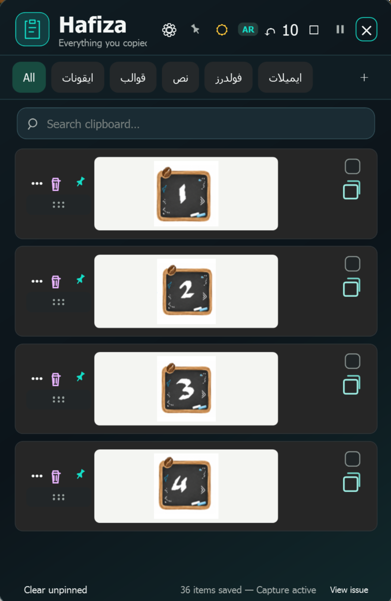

# حافظة Hafiza



## English

Hafiza is a clipboard manager for Windows that saves copied text, images, and files. Organize items in named tabs and folders, pin important items, search your history, and paste back into the app you were using.

### Download and install

[Download the latest Windows x64 release](https://github.com/anshtainalarab/Hafiza/releases/latest), then run `Hafiza-Setup-*.exe`. The installer includes the .NET runtime, so users do not need to install it separately.

### Use

- Copy text, an image, or files, then press `Ctrl + Shift + V` to open Hafiza.
- Click an item to paste it into the previously active window.
- Create tabs with `+`, add items to them from the `•••` menu, and rename or remove tabs with a right click.
- Pin items within a tab, search saved items, and drag cards to reorder them.
- Closing the window keeps Hafiza running in the tray; use the tray icon to exit fully.

### Build from source

On Windows 10/11 with the .NET 8 SDK, run:

```powershell
dotnet build .\Hafiza\Hafiza.csproj -c Release
```

Clipboard history stays on your device in `%LOCALAPPDATA%\Hafiza`; the app does not send it to the internet.

## العربية

حافظة تطبيق لويندوز يحفظ النصوص والصور والملفات المنسوخة، مع تبويبات وفولدرات قابلة للتنظيم والتثبيت والبحث واللصق السريع.

## التحميل

[حمّل أحدث نسخة لويندوز 64 بت](https://github.com/anshtainalarab/Hafiza/releases/latest). افتح ملف `Hafiza-Setup-*.exe` واتبع خطوات التثبيت. يتضمن ملف التثبيت متطلبات تشغيل .NET.

## الاستخدام

- شغّل التطبيق ثم انسخ أي نص أو صورة.
- افتح النافذة بالاختصار `Ctrl + Shift + V`.
- اضغط على عنصر للصقه مباشرة في النافذة التي كنت تعمل بها.
- اسحب البطاقة من مقبض النقاط لإعادة ترتيبها؛ يُحفظ ترتيبك تلقائيًا.
- أنشئ تبويبًا بزر `+`، ثم استخدم قائمة `•••` على العنصر لإضافته إلى التبويب.
- انقر بزر الفأرة الأيمن على أي تبويب لإعادة تسميته أو حذفه.
- زر الدبوس يثبت العنصر داخل التبويب الحالي فقط، من دون تغيير مكانه أو التأثير في بقية التبويبات.
- تبويب «الكل» مستقل ويستقبل كل نسخة جديدة تلقائيًا.
- «مسح غير المثبّت» يزيل العناصر من التبويب المفتوح فقط ولا يؤثر في بقية التبويبات.
- حذف عنصر يزيله من التبويب المفتوح فقط، ويظل موجودًا في أي تبويب آخر.
- إغلاق النافذة يخفي التطبيق؛ الخروج الكامل متاح من أيقونته قرب الساعة.

## البناء

يتطلب Windows 10/11 وحزمة تطوير .NET 8 SDK:

```powershell
dotnet build .\Hafiza\Hafiza.csproj -c Release
```

سيظهر التطبيق داخل `Hafiza\bin\Release\net8.0-windows\Hafiza.exe`.

تُحفظ البيانات محليًا في `%LOCALAPPDATA%\Hafiza` ولا تُرسل إلى الإنترنت.

## نسخة التوزيع

ملف التثبيت الجاهز لأجهزة Windows 10/11 بنظام x64 هو `Release\Hafiza-Setup-1.1.1-win-x64.exe`.
يشمل التطبيق ووقت تشغيل .NET، لذلك لا يحتاج المستلم إلى تثبيت .NET أو أدوات بناء.
يُثبت البرنامج لحساب المستخدم ويُنشئ اختصارًا في قائمة «ابدأ». يمكن إنشاء اختصار لسطح المكتب أثناء التثبيت.
تظل بيانات المستخدم في `%LOCALAPPDATA%\Hafiza` عند إزالة البرنامج.

لإعادة بناء ملف التثبيت بعد تعديل التطبيق، شغّل `package.ps1` على جهاز التطوير بعد توفير .NET 8 SDK ومترجم Inno Setup 7 في `.tools\InnoSetup`.
يجب تحديث رقم الإصدار في `Hafiza\Hafiza.csproj` و`installer.iss` معًا عند إصدار نسخة جديدة.
